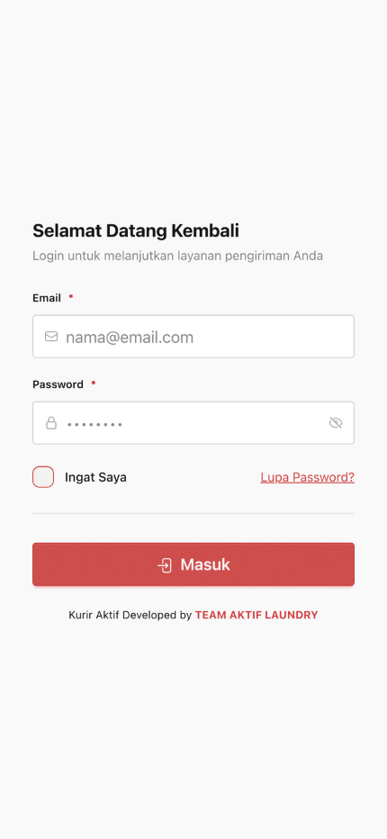

# :material-login: Login & Autentikasi

---

## :key: Cara Login

!!! info "Login Pertama Kali"
    Email dan password akan diberikan oleh admin saat pendaftaran

1. Buka aplikasi SiAktif Kurir
2. Masukkan **Email** dan **Password** yang telah diberikan oleh admin
3. (Opsional) Centang **"Ingat Saya"** agar tidak perlu login berulang
4. Klik tombol **"Masuk"**

---

## :question: Lupa Password (Klasik!)

Tenang, kita semua pernah di posisi ini. Password itu kayak janji mantan, susah diinget :sweat_smile:

!!! tip "Langkah Reset Password"

    1. Klik link **"Lupa Password?"** di halaman login
    2. Masukkan email kamu (yang masih aktif ya, bukan email jaman SMP)
    3. Klik **"Kirim Link Reset"**
    4. Cek inbox email. **Gak ada?** Cek folder **Spam/Junk** dulu! (sering banget kesana soalnya)
    5. Klik link yang ada di email
    6. Bikin password baru (yang gampang diinget tapi susah ditebak orang)
    7. Login lagi deh!

!!! warning "Pro Tip"
    Jangan pake password "123456" atau "password". Itu mah kayak kunci rumah ditaro di bawah keset :closed_lock_with_key:

---

## :envelope: Verifikasi Email

!!! info "Kenapa Harus Verifikasi?"
    Email harus diverifikasi dulu biar akun kamu aman (dan biar admin yakin kamu bukan robot :robot:)

**Langkah Verifikasi:**

1. Setelah login pertama kali, bakal muncul halaman verifikasi
2. Buka email kamu, cek inbox (atau Spam, lagi-lagi)
3. Klik link verifikasi yang ada di email
4. Kalo emailnya gak masuk-masuk, klik **"Kirim Ulang"**

!!! note "Catatan Penting"
    Tombol "Kirim Ulang" ada cooldown 1 menit. Jadi jangan di-spam ya, kasian servernya capek :sleeping:

---

!!! success "Selesai!"
    Setelah berhasil login dan verifikasi, lanjut ke [Navigasi Aplikasi](navigasi.md) untuk mengenal interface aplikasi.
