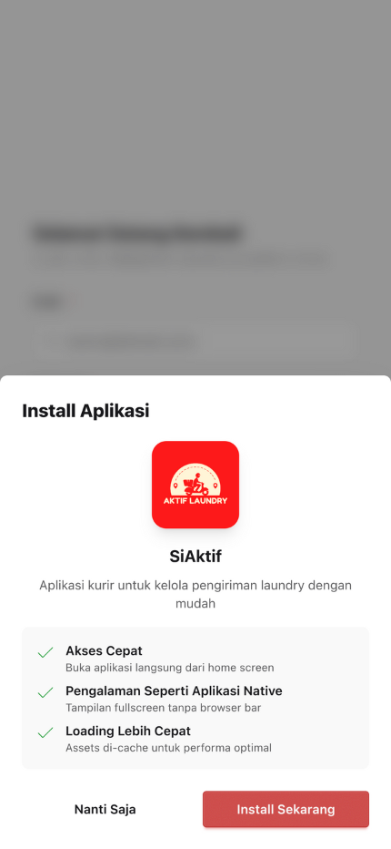

# :material-download: Cara Install Aplikasi

## :star2: Install Dulu Biar Makin Pro!

Aplikasi ini bisa diinstall ke home screen HP kamu. Jadi nanti bukanya gak pake ribet masuk browser dulu. Langsung klik aja kayak buka Instagram!

---

## :zap: Instalasi Otomatis (Gampang Banget!)

!!! success "Cara Paling Mudah"
    Ini cara termudah dan tercepat untuk install aplikasi!

1. Buka aplikasi di browser (Chrome/Safari)
2. Liat ada **tombol biru melayang** di kanan bawah? Yang loncat-loncat lucu itu loh :point_down:
3. Klik tombolnya, nanti muncul pop-up keren
4. Klik **"Install Sekarang"**
5. BOOM! :boom: Aplikasi udah di home screen

!!! tip "Pro Tip"
    Setelah install, tombol biru tadi bakal ilang sendiri. Dia tau diri kok, udah gak dibutuhin lagi :wink:

---

## :wrench: Instalasi Manual (Kalo yang otomatis ngambek)

=== "Android (Chrome/Brave)"

    !!! info "Untuk Pengguna Android"
        Langkah-langkah berikut untuk browser Chrome atau Brave

    1. Tap titik 3 di pojok kanan atas **(⋮)**
    2. Cari **"Install app"** atau **"Add to Home screen"** (biasanya di tengah-tengah)
    3. Tap **"Install"**
    4. Cek home screen, udah ada kan? Kalo belum coba scroll, mungkin nyasar :laughing:

=== "iOS (Safari)"

    !!! info "Untuk Pengguna iOS"
        Langkah-langkah berikut untuk browser Safari di iPhone/iPad

    1. Tap ikon **Share (:fontawesome-solid-share-from-square:)** di bagian bawah (yang kayak kotak dengan anak panah ke atas)
    2. Scroll ke bawah, cari **"Add to Home Screen"**
    3. Tap **"Add"**
    4. Selesai! Aplikasi udah mejeng di home screen bareng app lainnya :tada:

!!! question "Masih Bingung?"
    Kalo masih bingung, tanya anak/ponakan/tetangga yang jago. Atau chat admin aja, gak usah malu! :smile:

---

!!! success "Selesai!"
    Setelah install, aplikasi siap digunakan! Lanjut ke [Login & Autentikasi](autentikasi.md) untuk mulai menggunakan aplikasi.
