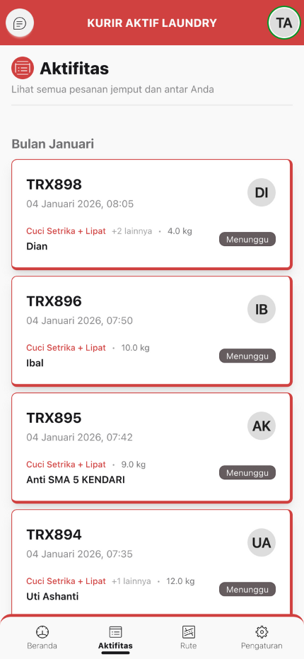

# :material-clipboard-list: Aktifitas

Halaman yang menampilkan semua pesanan yang dapat Anda jemput atau antar.

---

## :material-feature-search: Fitur Utama

-   :material-calendar-clock:{ .lg .middle } **Pengelompokan per Periode**

    ---

    Pesanan dikelompokkan berdasarkan waktu: Hari Ini, Minggu Ini, Bulan Ini, dll

-   :material-refresh:{ .lg .middle } **Auto-refresh Setiap 10 Detik**

    ---

    Data selalu update otomatis tanpa perlu refresh manual

-   :material-arrow-expand-down:{ .lg .middle } **Load More**

    ---

    Tombol "Lebih Banyak" untuk memuat lebih banyak data

-   :material-arrow-collapse-up:{ .lg .middle } **Load Less**

    ---

    Tombol "Lebih Sedikit" untuk mengurangi data yang ditampilkan

!!! tip "Pro Tip"
    Data otomatis refresh setiap 10 detik, jadi Anda selalu mendapat pesanan terbaru tanpa perlu refresh manual!

---

## :material-information: Informasi di Setiap Card

**Detail pesanan yang ditampilkan:**

- :material-barcode: Kode transaksi
- :material-clock: Tanggal & waktu masuk
- :material-tshirt-crew: Nama layanan + jumlah layanan lainnya
- :material-weight: Quantity (kg/pcs)
- :material-account: Nama pelanggan
- :material-account-circle: Avatar pelanggan
- :material-tag: Badge status (Menunggu/Proses/Selesai/Diambil)

!!! note "Akses Detail"
    **Klik card** untuk melihat detail lengkap pesanan dan melakukan aksi (jemput/antar)
