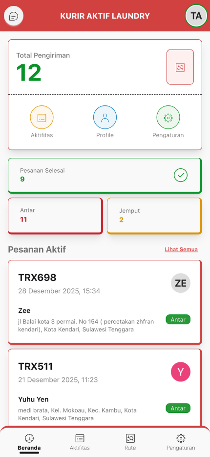

# :material-home: Beranda

Halaman dashboard yang menampilkan ringkasan pekerjaan Anda.

---

## :material-chart-box: Informasi yang Ditampilkan

-   :material-counter:{ .lg .middle } **Statistik Utama**

    ---

    Total Pengiriman - Jumlah total pesanan yang Anda tangani

    Tombol cepat ke: Aktifitas, Profile, Pengaturan

-   :material-chart-bar:{ .lg .middle } **Mini Statistik**

    ---

    - **Pesanan Selesai** - Pesanan yang sudah diantar dan diambil pelanggan
    - **Antar** - Jumlah pesanan yang Anda antar
    - **Jemput** - Jumlah pesanan yang Anda jemput

---

## :material-package-variant: Pesanan Aktif

!!! info "Maksimal 3 Pesanan"
    Menampilkan pesanan yang sedang Anda kerjakan (maksimal 3 pesanan)

**Badge Status:**

- **Badge "Jemput"** (kuning) - Pesanan yang sedang dijemput (status: Proses)
- **Badge "Antar"** (hijau) - Pesanan yang sedang diantar (status: Selesai)

---

## :material-history: Aktifitas Terbaru

!!! tip "Pesanan Terbaru"
    Menampilkan 3 pesanan terbaru dengan informasi lengkap

**Informasi yang ditampilkan:**

- Kode transaksi
- Nama layanan
- Jumlah (kg/pcs)
- Nama pelanggan
- Status pesanan

!!! note "Lihat Lebih Lengkap"
    Klik **"Lihat Semua"** untuk melihat daftar lengkap di halaman Aktifitas
