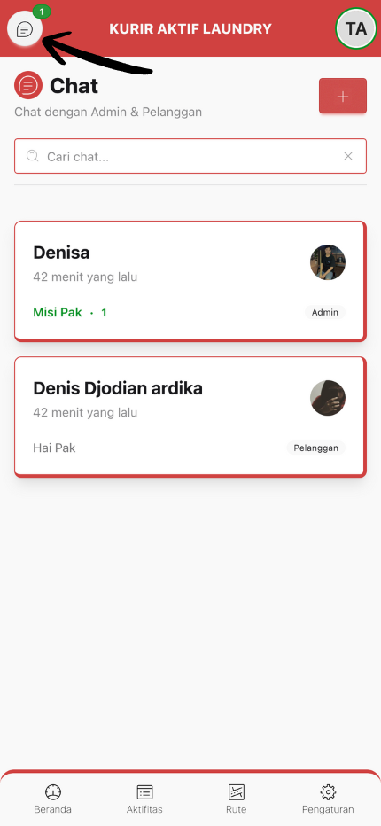

# :material-chat: Chat

Halaman untuk berkomunikasi dengan Admin dan Pelanggan.

---

## :material-star: Fitur Utama

-   :material-magnify:{ .lg .middle } **Search**

    ---

    Cari percakapan berdasarkan nama atau isi pesan dengan mudah

-   :material-numeric:{ .lg .middle } **Badge Unread**

    ---

    Indikator jumlah pesan belum dibaca di setiap percakapan

-   :material-tag:{ .lg .middle } **Badge Tipe**

    ---

    Menampilkan tipe participant (Admin/Pelanggan)

-   :material-clock:{ .lg .middle } **Last Message**

    ---

    Preview pesan terakhir & waktu pengiriman

-   :material-account-circle:{ .lg .middle } **Status Online/Offline**

    ---

    Avatar dengan indikator status online real-time

---

## :material-message-plus: Buat Chat Baru

!!! tip "Langkah-langkah Membuat Chat"

    1. Klik tombol **"Buat Chat"**
    2. Pilih **Tipe Participant** (Admin atau Pelanggan)
    3. Pilih **Participant** dari dropdown
    4. Klik **"Buat Chat"**

!!! success "Chat Siap Digunakan"
    Setelah membuat chat, chat room akan otomatis terbuka dan Anda bisa langsung mengirim pesan!

---

## :material-cursor-pointer: Membuka Percakapan

!!! note "Akses Chat Room"
    **Klik percakapan** dari daftar untuk membuka chat room dan mulai berkomunikasi
