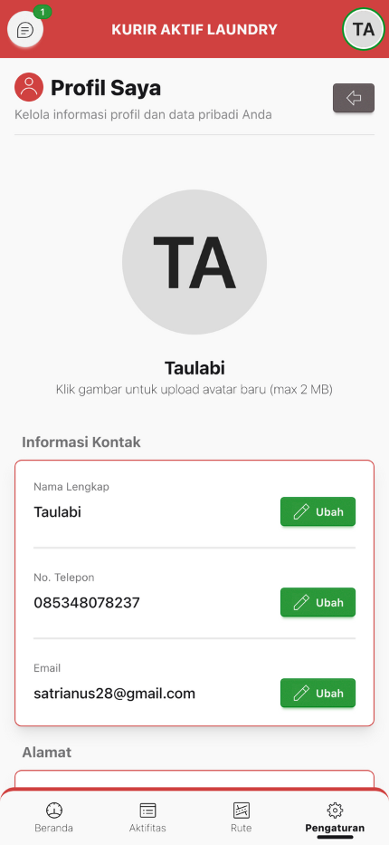

# :material-account-edit: Cara Edit Profile & Set Lokasi

Panduan lengkap mengelola profil dan mengatur lokasi rumah Anda.



---

## :material-image-edit: Upload Avatar

!!! info "Cara Upload Foto Profil"

    1. Buka menu **"Pengaturan"** > Klik **"Kelola Profil"**
    2. Klik **gambar avatar** di bagian atas
    3. Pilih foto dari galeri
    4. Avatar akan otomatis terupload dan ter-update

**Persyaratan foto:**

- **Format:** JPG, PNG
- **Ukuran maksimal:** 2 MB

---

## :material-account-edit-outline: Edit Nama

!!! tip "Ubah Nama Lengkap"

    1. Di halaman Profile, klik tombol **"Ubah"** di baris Nama
    2. Modal akan muncul
    3. Ketik nama lengkap baru
    4. Klik **"Simpan"**

---

## :material-phone-edit: Edit Nomor HP

!!! tip "Ubah Nomor Telepon"

    1. Klik tombol **"Ubah"** di baris No. Telepon
    2. Masukkan nomor HP baru
    3. Klik **"Simpan"**
    4. Nomor akan otomatis di-format ke format +62

**Format yang diterima:**

- 08xxxxxxxxxx
- 628xxxxxxxxxx
- +628xxxxxxxxxx

---

## :material-email-edit: Edit Email

!!! tip "Ubah Email"

    1. Klik tombol **"Ubah"** di baris Email
    2. Masukkan email baru (opsional, boleh kosong)
    3. Klik **"Simpan"**

!!! note "Email Harus Unik"
    Email harus unik dan belum digunakan kurir lain

---

## :material-map-marker-plus: Edit Alamat dengan Peta Interaktif


!!! success "Fitur Paling Penting"
    Fitur ini memastikan lokasi Anda akurat untuk koordinasi yang lebih baik!

### :material-numeric-1-box: Langkah 1: Buka Modal Edit Alamat

1. Di halaman Profile, scroll ke bagian "Alamat"
2. Klik tombol **"Ubah Alamat"**
3. Modal akan muncul dengan form dan peta

---

### :material-numeric-2-box: Langkah 2: Pilih Wilayah

<div class="grid cards" markdown>

-   :material-sign-real-estate:{ .lg .middle } **Pilih Kecamatan**

    ---

    Dropdown otomatis terisi dengan kecamatan di Kendari

-   :material-home-city:{ .lg .middle } **Pilih Kelurahan/Desa**

    ---

    Pilihan kelurahan akan muncul sesuai kecamatan

-   :material-text:{ .lg .middle } **Isi Detail Alamat**

    ---

    Contoh: "Jl. Sudirman No. 45, RT 02/RW 05, Samping Indomaret"

    Minimal 10 karakter

</div>

---

### :material-numeric-3-box: Langkah 3: Set Lokasi di Peta

!!! info "Ada 3 Cara Set Lokasi"

=== "Cara 1: Klik Peta"

    - Klik titik di peta yang sesuai dengan lokasi rumah Anda
    - Marker akan muncul di posisi yang diklik
    - Koordinat otomatis ter-update

=== "Cara 2: Drag Marker"

    - Jika marker sudah ada, drag ke posisi yang tepat
    - Koordinat akan update saat Anda lepas marker

=== "Cara 3: Gunakan GPS Otomatis"

    - Klik tombol **"Ambil Lokasi Saya"** di bawah peta
    - Perangkat akan mendeteksi lokasi GPS Anda
    - Marker akan muncul di posisi GPS
    - Peta otomatis center ke lokasi Anda

!!! tip "Rekomendasi"
    Gunakan GPS otomatis saat Anda berada di rumah untuk akurasi terbaik!

---

### :material-numeric-4-box: Langkah 4: Gunakan Kontrol Peta

<div class="grid cards" markdown>

-   :material-magnify:{ .lg .middle } **Zoom**

    ---

    - Klik **+** untuk zoom in (perbesar)
    - Klik **-** untuk zoom out (perkecil)
    - Atau gunakan pinch gesture

-   :material-layers:{ .lg .middle } **Layer**

    ---

    - **Street** - Untuk lihat nama jalan
    - **Satellite** - Untuk lihat foto satelit (rekomendasi untuk cari rumah)

</div>

---

### :material-numeric-5-box: Langkah 5: Simpan Alamat

!!! success "Finalisasi Alamat"

**Pastikan semua field sudah terisi:**

- Kecamatan :material-check:
- Kelurahan :material-check:
- Detail alamat :material-check:
- Marker sudah di peta :material-check:

**Kemudian:**

1. Klik tombol **"Simpan"**
2. Alamat lengkap akan ter-generate otomatis
3. Modal akan tertutup

---

## :material-text-box-check: Preview Alamat Lengkap

!!! note "Format Alamat"
    Setelah simpan, alamat akan ditampilkan dalam format:

```
[Detail Alamat], Kelurahan [Kelurahan], Kecamatan [Kecamatan],
Kota Kendari, Sulawesi Tenggara
```

!!! warning "Pentingnya Lokasi Akurat"
    Lokasi yang akurat membantu:

    - Admin menghubungi Anda dengan mudah
    - Pelanggan mengetahui lokasi Anda
    - Memudahkan navigasi saat jemput/antar pesanan
