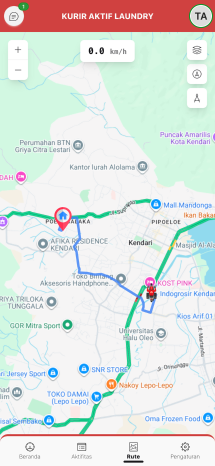
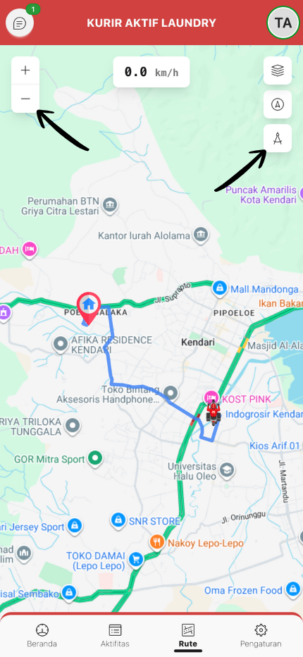

# :material-map: Cara Menggunakan Navigasi Rute (Fitur Paling Canggih!)

Panduan lengkap menggunakan fitur navigasi GPS real-time.

---

## :material-clipboard-check: Persiapan Sebelum Navigasi (Checklist Penting!)

!!! warning "Checklist Wajib"
    Sebelum gas pol, pastikan ini semua udah oke:

-   :material-crosshairs-gps:{ .lg .middle } **GPS Nyala**

    ---

    Cek di pengaturan HP, jangan sampai mati

-   :material-wifi:{ .lg .middle } **Internet Stabil**

    ---

    Minimal 3G/4G biar peta gak lemot

-   :material-map-marker-check:{ .lg .middle } **Izin Lokasi**

    ---

    Pas pertama buka app biasanya minta izin, klik "Allow"

-   :material-battery:{ .lg .middle } **Baterai Cukup**

    ---

    Minimal 30%. GPS itu rakus baterai, kayak orang laper!

!!! tip "Jangan Lupa"
    Bawa powerbank kalo perjalanan jauh. Baterai drop di tengah jalan = nightmare!

---

## :material-numeric-1-box: Langkah 1: Buka Navigasi Rute

!!! info "Ada 2 Cara"

=== "Cara 1: Dari Detail Pesanan"

    1. Setelah klik "Jemput Pesanan" atau "Antar Pesanan"
    2. Otomatis diarahkan ke halaman Rute Detail

=== "Cara 2: Dari Menu Rute"

    1. Buka menu **"Rute"** dari bottom navigation
    2. Klik salah satu pesanan aktif
    3. Halaman peta navigasi akan terbuka

---

## :material-numeric-2-box: Langkah 2: Memahami Tampilan Peta

### :material-map-marker-multiple: Elemen Peta

-   :material-motorbike:{ .lg .middle } **Marker Anda**

    ---

    - Ikon sesuai jenis kendaraan yang didaftarkan
    - Menunjukkan posisi real-time Anda
    - Berputar sesuai arah pergerakan (bearing)

-   :material-home:{ .lg .middle } **Marker Pelanggan**

    ---

    - Menunjukkan lokasi tujuan
    - Klik untuk lihat info pelanggan

-   :material-routes:{ .lg .middle } **Garis Rute**

    ---

    - Jalur yang harus diikuti (warna biru)
    - Otomatis update jika Anda keluar jalur

### :material-gesture-tap: Kontrol Peta

-   :material-magnify:{ .lg .middle } **Kiri Atas - Zoom Controls**

    ---

    - **Tombol +** : Zoom in (perbesar)
    - **Tombol -** : Zoom out (perkecil)

-   :material-speedometer:{ .lg .middle } **Tengah Atas - Speed Indicator**

    ---

    Menampilkan kecepatan Anda saat ini dalam **km/h** (update real-time setiap detik)

-   :material-layers:{ .lg .middle } **Kanan Atas - Map Controls**

    ---

    - **Layer**: Ganti tampilan peta (Street/Satellite/Traffic)
    - **Center**: Pusat peta ke lokasi Anda
    - **Compass**: Orientasi peta mengikuti arah hadap Anda

---

## :material-numeric-3-box: Langkah 3: Mengikuti Navigasi

!!! success "Ikuti Langkah Ini"

**1. Aktifkan GPS:**

- GPS akan otomatis mencari sinyal
- Status "Mencari..." akan muncul
- Setelah fix, status berubah "Aktif" (hijau)

**2. Posisi Marker Anda:**

- Marker Anda akan muncul di posisi GPS
- Marker berputar sesuai arah pergerakan

**3. Garis Rute:**

- Rute terbaik otomatis dihitung
- Berwarna biru dari posisi Anda ke tujuan

**4. Ikuti Rute:**

- Perhatikan garis rute di peta
- Jika keluar jalur, rute akan recalculate otomatis
- Lihat indikator kecepatan untuk kontrol kecepatan

---

## :material-numeric-4-box: Langkah 4: Menggunakan Fitur Lanjutan

### :material-layers-triple: Ganti Layer Peta

!!! tip "Rekomendasi Layer"

1. Klik tombol **Layer** (kanan atas)
2. Pilih:
   - **Street** - Untuk lihat nama jalan
   - **Satellite** - Untuk lihat foto satelit
   - **Traffic** - Untuk lihat kondisi lalu lintas (rekomendasi)

### :material-pan: Zoom & Orientasi

- **Zoom in/out** - Gunakan tombol +/- atau pinch gesture
- **Pusat ke Lokasi** - Klik tombol Center jika peta bergeser
- **Aktifkan Compass** - Klik tombol Compass untuk rotasi peta sesuai arah hadap

### :material-cursor-pointer: Klik Marker

- **Marker Anda** - Lihat koordinat, akurasi GPS, arah, dan kecepatan
- **Marker Pelanggan** - Lihat nama dan alamat

---

## :material-lightbulb: Tips Navigasi (Biar Makin Jago!)

!!! success "Supaya GPS Akurat Banget"

    - **Pake di tempat terbuka** - Gedung tinggi = musuh GPS. Jauhin!
    - **Langit keliatan** - Indoor/basement = GPS ngambek. Keluar dulu bro!
    - **Sabar dikit** - Tunggu 10-20 detik biar GPS "ngunci" satelit. Akurasi di bawah 10 meter = mantap!

!!! tip "Hemat Baterai Pas Navigasi"

    - **Pake layer "Traffic"** - Jangan "Satellite", boros banget!
    - **Kurangin brightness** - Mata enak, baterai hemat. Win-win!
    - **Tutup app lain** - Fokus navigasi aja, TikTok belakangan

!!! info "Kondisi Macet? Tenang Aja!"

    **1. Aktifin layer Traffic** - Bakal keliatan warna jalanan:

    - **Merah** = Macet parah, siap-siap sabar
    - **Kuning** = Macet dikit, santai
    - **Hijau** = Lancar jaya, gas pol!

    **2. Cari jalan alternatif** - Swipe peta, cari jalan lain yang lebih ijo

!!! note "Privacy Note"
    GPS tracking **cuma jalan** pas halaman Rute Detail dibuka. Tutup halaman = tracking stop. Jadi gak disadap 24/7 ya, tenang aja!
